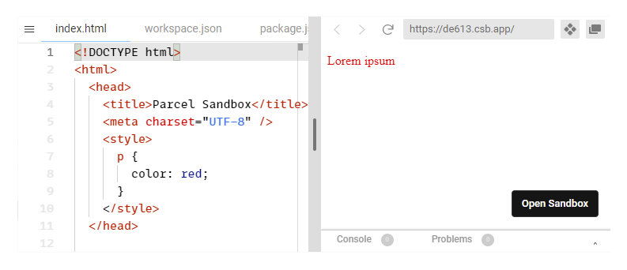
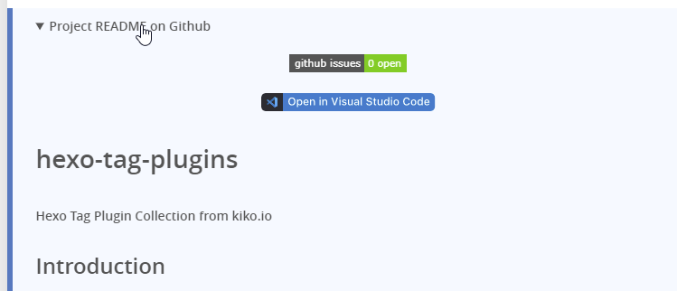
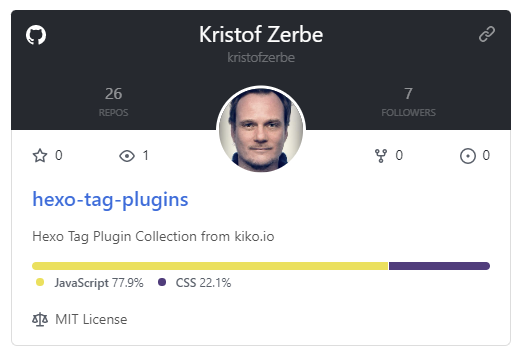
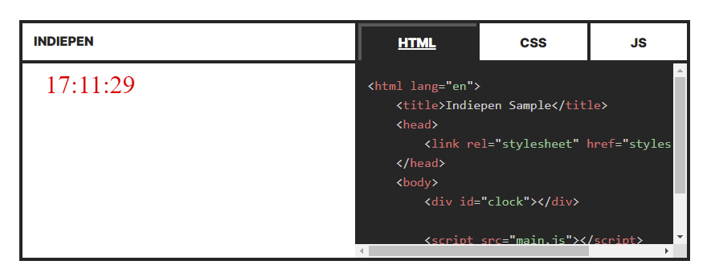

[](https://github.com/kristofzerbe/hexo-tag-plugins/issues)

# Hexo Tag Plugins

**Hexo Tag Plugin Collection from kiko.io**

## Introduction

**[Hexo](https://hexo.io/)** is a [Markdown](https://en.wikipedia.org/wiki/Markdown) based SSG (Static Site Generator). Because the Mardown syntax is limited for good reason, Hexo has ***tag plugins*** you can use in your content to simplify and centralize complex structures, instead of writing pure HTML. For more information, see [hexo.io/docs/tag-plugins](https://hexo.io/docs/tag-plugins.html).

This project is a growing collection of tag plugins that I have developed and use for my blog [kiko.io](https://kiko.io). Some of them are quite simple, others are more complex, but overall maybe helpful for you.

## Installation / Using

There is no automatic installation of all tag plugins via NPM or other package managers, because every tag plugin stands for itself and you can pick the one you need simply by copying the appropriate JS file into your Hexo's script folder: ``THEMES`` / ``<YOUR-THEME>`` / ``SCRIPTS``.

For every tag plugin in the list below I provide a [Visual Studio Code Snippet](https://code.visualstudio.com/docs/editor/userdefinedsnippets) to quickly insert a plugin into the content via the hotkey ``Ctrl+Space``. To use the snippest create a new ``.code-snippets`` file in your projects ``.vscode`` folder and insert the snippets of all tag plugins you have downloaded into your project.

### Parameter Description Syntax

Every tag plugin includes a description in the header how to use it. The syntax is as follows:

| Syntax | Description |
| --- | --- |
| ``param1`` | mandatory parameter |
| ``[param2]`` | optional parameter |
| ``[param2=default]`` | optional parameter with default value|
| ``param:(option1,option2)`` | parameter option list to choose one option |
| ``..."value1\|value2"``| pipe delimitered array of values |


## Plugins

- [Anchor](#anchor)
- [Anchorlist](#anchorlist)
- [Alertbox](#alertbox)
- [Alternative Blockquote](#alternative-blockquote)
- [Blockquote Details](#blockquote-details)
- [Codepen](#codepen)
- [CodeSandbox](#codesandbox)
- [Download Link](#download-link)
- [Github Readme](#github-readme)
- [GitHub User & Repo Card](#github-user--repo-card)
- [Image Compare](#image-compare)
- [Image Link](#image-link)
- [Image Slide](#image-slide)
- [Indiepen](#indiepen)
- [More Info](#more-info)
- [Image Masonry](#image-masonry)


## Anchor

A simple anchor element as ``A``- or ``HR``-Tag as jump target for example from a ``Anchorlist``.

**Files:**

- [tag-anchor.js](https://github.com/kristofzerbe/hexo-tag-plugins/blob/main/tag-anchor.js)

**Syntax:**  

```txt
``
```

**Parameters:**

| No | Parameter | optional/default | Description |
| --- | --- | --- | --- |
| 1 | ``anchorId`` | - | String to define the anchor id |
| 2|  ``elementType`` | - | Type of tag to render; select out of ``A`` or  ``HR`` |

**Usage Example:**

```js

```

**Output:**

```html
<hr id="my-anchor">
```

**VS Code Snippet:**

```json
"hexo.kiko-io.anchor": {
  "scope": "markdown",
  "prefix": "hexo.kiko-io.anchor",
  "body": [
    ""
  ],
  "description": "Insert kiko.io's anchor"
}
```


## Anchorlist

Creates an overview of all anchors in the content with jump links.

**Files:**

- [tag-anchorlist.js](https://github.com/kristofzerbe/hexo-tag-plugins/blob/main/tag-anchorlist.js)
  
**Syntax:**  

```txt

```

**Parameters:**

| No | Parameter | optional/default | Description |
| --- | --- | --- | --- |
| 1 | ``..."title\|anchorId"`` | - | List of pipe separated items with referencing title and anchor id |

**Usage Example:**

```js

```

**Output:**

```html
<ul class="anchorlist">
  <li data-anchor="#a1">
    <a href="#a1">My First Anchor</a>
  </li>
  <li data-anchor="#a2">
    <a href="#a2">My Second Anchor</a>
  </li>
</ul>
```


**VS Code Snippet:**

```json
"hexo.kiko-io.anchorlist": {
  "scope": "markdown",
  "prefix": "hexo.kiko-io.anchorlist",
  "body": [
    ""
  ],
  "description": "Insert kiko.io's anchorlist"
}
```


## Alertbox

Renders a iconized colored box with text for warnings or with some special information. 6 styles are provided: Exclamation, Question, Warning, Info, Success and Note.

**Files:**

- [tag-alertbox.js](https://github.com/kristofzerbe/hexo-tag-plugins/blob/main/tag-alertbox.js)
- [tag-alertbox.css](https://github.com/kristofzerbe/hexo-tag-plugins/blob/main/tag-alertbox.css)
  
**Prequisites:**

The icons are from the font **FontAwesome Free Solid**, you need to reference in your CSS either from your project or from a CDN. You will find such  references in the file ``tag-alertbox.css``, together with all other necessary styles.

**Syntax:**

```txt

content
``
```

**Parameters:**

| No | Parameter | optional/default | Description |
| --- | --- | --- | --- |
| 1 | ``alertType`` | - | Type of the alert (icon and color); select out of ``exclamation``, ``question``, ``warning``, ``info``, ``success`` or ``note`` |

``content`` is not a parameter, but Markdown to render.

**Usage Example:**

```js

Something has failed!

```

**Output:**

```html
<div class="alertbox alertbox-warning">
  <p>Something has failed!</p>
</div>
```


See a live example at [https://kiko.io/post/Hexo-Tag-Plugin-Collection/#alertbox](https://kiko.io/post/Hexo-Tag-Plugin-Collection/#alertbox)

**VS Code Snippet:**

```json
"hexo.kiko-io.alertbox": {
  "scope": "markdown",
  "prefix": "hexo.kiko-io.alertbox",
  "body": [
    "",
    "${2:content}",
    ""
  ],
  "description": "Insert kiko.io's alertbox"
}
```


## Alternative Blockquote

An alternative blockquote tag plugin for quotes with citator and reference url.

**Files:**

- [tag-blockquote_alt.js](https://github.com/kristofzerbe/hexo-tag-plugins/blob/main/tag-blockquote_alt.js)
  
**Syntax:**  

```txt

quote

```

**Parameters:**

| No | Parameter | optional/default | Description |
| --- | --- | --- | --- |
| 1 | ``cite`` | | Author of the quote |
| 2 | ``citeUrl`` | yes | Url to the quote |

**Usage Example:**

```js

Lorem ipsum dolor sit amet...

```

**Output:**

```html
<div>
  <blockquote>
    <p>Lorem ipsum dolor sit amet…</p>
  </blockquote>
  <cite>
    <a href="https://en.wikipedia.org/wiki/Lorem_ipsum">--- Anonymous</a>
  </cite>
</div>
```


See a live example at [https://kiko.io/post/Hexo-Tag-Plugin-Collection/#blockquote_alt](https://kiko.io/post/Hexo-Tag-Plugin-Collection/#blockquote_alt)

**VS Code Snippet:**

```json
"hexo.kiko-io.blockquote": {
  "scope": "markdown",
  "prefix": "hexo.kiko-io.blockquote",
  "body": [
    "",
    "${3:content}",
    ""
  ],
  "description": "Insert kiko.io's blockquote"
}
```


## Blockquote Details

Blockquote including summary, citator and reference url, wrapped in a ``details`` tag.

**Files:**

- [tag-blockquote_details.js](https://github.com/kristofzerbe/hexo-tag-plugins/blob/main/tag-blockquote_details.js)
  
**Syntax:**  

```txt

quote


```

**Parameters:**

| No | Parameter | optional/default | Description |
| --- | --- | --- | --- |
| 1 | ``summary`` | - | Summary of the quote |
| 2 | ``cite`` | - | Author of the quote |
| 3 | ``citeUrl`` | yes | Url to the quote |

``quote`` is not a parameter, but Markdown to render.

**Usage Example:**

```js

Lorem ipsum dolor sit amet, consectetur adipiscing elit, sed do eiusmod tempor incididunt ut labore et dolore magna aliqua. Ut enim ad minim veniam, quis nostrud exercitation ullamco laboris nisi ut aliquip ex ea commodo consequat.

```

**Output:**

```html
<details>
  <summary>Lorem ipsum</summary>
  <blockquote>
    <p>
      Lorem ipsum dolor sit amet, consectetur adipiscing elit, sed do eiusmod tempor incididunt ut labore et dolore magna aliqua. Ut enim ad minim veniam, quis nostrud exercitation ullamco laboris nisi ut aliquip ex ea commodo consequat.
    </p>
  </blockquote>
  <cite>
    <a href="https://en.wikipedia.org/wiki/Lorem_ipsum">--- Anonymous</a>
  </cite>
</details>
```


See a live example at [https://kiko.io/post/Hexo-Tag-Plugin-Collection/#blockquote_details](https://kiko.io/post/Hexo-Tag-Plugin-Collection/#blockquote_details)

**VS Code Snippet:**

```json
"hexo.kiko-io.blockquote_details": {
  "scope": "markdown",
  "prefix": "hexo.kiko-io.blockquote_details",
  "body": [
    "",
    "${4:quote}",
    ""
  ],
  "description": "Insert kiko.io's blockquote_details"
}
```


## Codepen

Embedding a pen from [codepen.io](https://codepen.io).

**Files:**

- [tag-codepen.js](https://github.com/kristofzerbe/hexo-tag-plugins/blob/main/tag-codepen.js)
  
**Prequisites:**

You need following configuration section in your `_config.yml`:

```yml
# Codepen Defaults
codepen:
  user_id: "your-name"
  default_tab: "js"
  height: 400
  width: "100%"
```

**Syntax:**  

```txt

```

**Parameters:**

| No | Parameter | optional/default | Description |
| --- | --- | --- | --- |
| 1 | ``slugHash`` | - | Codepens SlugHash |
| 2 | ``title`` | - | Title |
| 3 | ``defaultTab`` | js | Default tab to show ; select out of ``html``, ``js`` or ``css`` |
| 4 | ``height`` | 300  | Height as number |
| 5 | ``width`` | "100%" | Width as CSS value |

**Usage Example:**

```js

```

**Output:**

```html
<iframe 
  height="400" 
  id="codepen-abjJNYE" 
  class="codepen" 
  src="https://codepen.io/kristofzerbe/embed/abjJNYE?height=400&amp;default-tab=html,result&amp;theme-id=light" 
  style="width: 100%;" 
  scrolling="no" 
  title="Codepen: Lorem Ipsum" 
  frameborder="no" 
  loading="lazy" 
  allowtransparency="true" 
  allowfullscreen="true">
</iframe>
```


See a live example at [https://kiko.io/post/Hexo-Tag-Plugin-Collection/#codepen](https://kiko.io/post/Hexo-Tag-Plugin-Collection/#codepen)

**VS Code Snippet:**

```json
"hexo.kiko-io.codepen": {
  "scope": "markdown",
  "prefix": "hexo.kiko-io.codepen",
  "body": [
    ""
  ],
  "description": "Insert kiko.io's codepen"
}
```


## CodeSandbox

Embedding a sandbox from [CodeSandbox](https://codesandbox.io/).

**Files:**

- [tag-codesandbox.js](https://github.com/kristofzerbe/hexo-tag-plugins/blob/main/tag-codesandbox.js)

**Syntax:**  

```txt

```

**Parameters:**

| No | Parameter | optional/default | Description |
| --- | --- | --- | --- |
| 1 | ``slugHash`` | - | Sandbox' SlugHash |
| 2 | ``title`` | - | Title |
| 3 | ``height`` | 500  | Height as number |
| 4 | ``width`` | "100%" | Width as CSS value |

**Usage Example:**

```js

```

**Output:**

```html
<iframe 
  src="https://codesandbox.io/embed/cool-shamir-de613?fontsize=14&amp;theme=light" 
  style="width:100%; height:300px; border:0; overflow:hidden;" 
  title="Lorem Ipsum" 
  sandbox="allow-forms allow-modals allow-popups allow-presentation allow-same-origin allow-scripts">
</iframe>
```



See a live example at [https://kiko.io/post/Hexo-Tag-Plugin-Collection/#codesandbox](https://kiko.io/post/Hexo-Tag-Plugin-Collection/#codesandbox)

**VS Code Snippet:**

```json
"hexo.kiko-io.codesandbox": {
  "scope": "markdown",
  "prefix": "hexo.kiko-io.codesandbox",
  "body": [
    ""
  ],
  "description": "Insert kiko.io's codesandbox"
}
```


## Download Link

Button link for downloading an asset file, with additional caption ("Download &lt;additionalCaption&gt; &lt;assetFile&gt;").

**Files:**

- [tag-download-link.js](https://github.com/kristofzerbe/hexo-tag-plugins/blob/main/tag-download-link.js)

**Syntax:**  

```txt

```

**Parameters:**

| No | Parameter | optional/default | Description |
| --- | --- | --- | --- |
| 1 | ``assetFile`` | | Asset file name to download |
| 2 | ``additionalCaption`` | yes | Additional caption between *"Download "* and file name |

**Usage Example:**

```js

```

**Output:**

```html
<p class="download-link">
  <a class="button" href="example-image_ORIGINAL.jpg" download="">
    Download Photo <strong>example-image_ORIGINAL.jpg</strong>
  </a>
</p>
```


See a live example at [https://kiko.io/post/Hexo-Tag-Plugin-Collection/#download-link](https://kiko.io/post/Hexo-Tag-Plugin-Collection/#download-link)

**VS Code Snippet:**

```json
"hexo.kiko-io.download_link": {
  "scope": "markdown",
  "prefix": "hexo.kiko-io.download_link",
  "body": [
    ""
  ],
  "description": "Insert kiko.io's download_link"
}
```


## Github Readme

Gets the README file of a Github repo and renders its Markdown as HTML in a ``detail`` tag.

**Files:**

- [tag-github-readme.js](https://github.com/kristofzerbe/hexo-tag-plugins/blob/main/tag-github-readme.js)
  
**Prequisites:**

You need to have installed the [**Axios** package](https://www.npmjs.com/package/axios) in your project.

The HTML output has no styles, therefore you need some in your CSS for ``.github-readme``.

**Syntax:**  

```txt

```

**Parameters:**

| No | Parameter | optional/default | Description |
| --- | --- | --- | --- |
| 1 | ``user`` | | Name of the GitHub user |
| 2 | ``repo`` | | Name of the GitHub repo |
| 3 | ``summary`` | "Project README on Github" | Caption of the DETAILS element |

**Usage Example:**

```js

```

**Output:**

```html
<details class="github-readme">
  <summary>Project README on Github</summary>
  <div>
    <!-- Content of the README file converted to HTML -->
  </div>
</details>
```



**VS Code Snippet:**

```json
"hexo.kiko-io.github_readme": {
  "scope": "markdown",
  "prefix": "hexo.kiko-io.github_readme",
  "body": [
    ""
  ],
  "description": "Insert kiko.io's github_readme"
}
```

See a live example at [https://kiko.io/post/GitHub-Tag-Plugins-for-Hexo/#readme](https://kiko.io/post/GitHub-Tag-Plugins-for-Hexo/#readme)


## GitHub User & Repo Card

Renders a card-like info panel, with full information about a GitHub repo and its creator, the GitHub user.

**Files:**

- [tag-github-user-and-repo-card.js](https://github.com/kristofzerbe/hexo-tag-plugins/blob/main/tag-github-user-and-repo-card.js)
- [tag-github-user-and-repo-card.css](https://github.com/kristofzerbe/hexo-tag-plugins/blob/main/tag-github-user-and-repo-card.css)
  
**Prequisites:**

You need to have installed the [**Axios** package](https://www.npmjs.com/package/axios) in your project.

**Syntax:**  

```txt

```

**Parameters:**

| No | Parameter | optional/default | Description |
| --- | --- | --- | --- |
| 1 | ``user`` | | Name of the GitHub user |
| 2 | ``repo`` | | Name of the GitHub repo |
| 3 | ``cardWidth`` | "400px" | Maximum width of the card; Minimum is 300px |
| 4 | ``userheight`` | "120px" | Height of the upper user panel |
| 5 | ``avatarSize`` | "90px" | Size of the avatar image as CSS value |

**Usage Example:**

```js

```

**Output:**

```html
<!-- see tag-github-user-and-repo-card.html -->
```



**VS Code Snippet:**

```json
"hexo.kiko-io.github_user_and_repo_card": {
  "scope": "markdown",
  "prefix": "hexo.kiko-io.github_user_and_repo_card",
  "body": [
    ""
  ],
  "description": "Insert kiko.io's github_user_and_repo_card"
}
```

See a live example at [https://kiko.io/post/GitHub-Tag-Plugins-for-Hexo/#user-and-repo-card](https://kiko.io/post/GitHub-Tag-Plugins-for-Hexo/#user-and-repo-card)


## Image Compare

Comparing two asset images side-by-side with the aid of the JS library [Image Compare Viewer](https://image-compare-viewer.netlify.app/).

**Files:**

- [tag-image-compare.js](https://github.com/kristofzerbe/hexo-tag-plugins/blob/main/tag-image-compare.js)
  
**Prequisites:**

As this tag plugin relies on an external JS library, the files ``image-compare-viewer.js`` and ``image-compare-viewer.css`` (or its minified versions) must be loaded in the header of the web page.

**Syntax:**  

```txt

```

**Parameters:**

| No | Parameter | optional/default | Description |
| --- | --- | --- | --- |
| 1 | ``imgFileOriginal`` | - | Original asset image file name |
| 2 | ``imgFileModified`` | - | Modified asset image file name |
| 3 | ``descriptionModified`` | - | Description |
| 4 | ``orientation`` | null | Vertical orientation Mode; set ``vertical`` to select |

**Usage Example:**

```js

```

**Output:**

```html
<div id="image-compare-1yrasq">
  
  
</div>
<script>
  var themeColor = "#ffffff";
  if (localStorage.getItem("theme") === 'dark') {
    themeColor = "#222222"
  }
  new ImageCompare(document.getElementById("image-compare-1yrasq"),
  {
    controlColor: themeColor,
    controlShadow: false,
    verticalMode: false,
    showLabels: true,
    labelOptions: {
      before: 'Original',
      after: 'Lightroom Preset',
      onHover: true,
    }
  }).mount();
</script>
```


See a live example at [https://kiko.io/post/Hexo-Tag-Plugin-Collection/#image-compare](https://kiko.io/post/Hexo-Tag-Plugin-Collection/#image-compare)

**VS Code Snippet:**

```json
"hexo.kiko-io.image_compare": {
  "scope": "markdown",
  "prefix": "hexo.kiko-io.image_compare",
  "body": [
    ""
  ],
  "description": "Insert kiko.io's image_compare"
}
```


## Image Link

Renders an image including ALT attribute within a link.

**Files:**

- [tag-image-link.js](https://github.com/kristofzerbe/hexo-tag-plugins/blob/main/tag-image-link.js)
  
**Syntax:**  

```txt

```

**Parameters:**

| No | Parameter | optional/default | Description |
| --- | --- | --- | --- |
| 1 | ``assetImg`` | - | Asset image file name |
| 2 | ``url`` | - | Url to link to |
| 3 | ``alt`` | - | Alternate text |

**Usage Example:**

```js

```

**Output:**

```html
<a href="http://kiko.io">
  
</a>
```

**VS Code Snippet:**

```json
"hexo.kiko-io.image_link": {
  "scope": "markdown",
  "prefix": "hexo.kiko-io.image_link",
  "body": [
    ""
  ],
  "description": "Insert kiko.io's image_link"
}
```


## Image Slide

Shows multiple images within a slider with the aid of the JS library [Tiny Slider](https://github.com/ganlanyuan/tiny-slider).

**Files:**

- [tag-image-slide.js](https://github.com/kristofzerbe/hexo-tag-plugins/blob/main/tag-image-slide.js)
  
**Prequisites:**

As this tag plugin relies on an external JS library, the files ``tiny-slider.js`` and ``tiny-slider.css`` (or its minified versions) must be loaded in the header of the web page.

The CSS file doesn't include styles for the ``.tns-nav`` and its controls, but you can use the following to extend the original CSS:

```css
.tns-nav {
    text-align: center;
    margin: 10px 0;
}
.tns-nav > [aria-controls] {
    width: 12px;
    height: 12px;
    padding: 0;
    margin: 0 5px;
    border-radius: 50%;
    background: #ddd;
    border: 0;
}
.tns-nav > .tns-nav-active {
    background: #999;
}
```

**Syntax:**  

```txt

```

**Parameters:**

| No | Parameter | optional/default | Description |
| --- | --- | --- | --- |
| 1 | ``..."assetImg\|title"`` | | List of pipe separated items with asset image file and title |

**Usage Example:**

```js

```

**Output:**

```html
<div class="image-slider" id="image-slide-w7jgxk">
  <div>
    
  </div>
  <div>
    
  </div>
</div>
<script>
  tns({
    container: "#image-slide-w7jgxk",
    items: 1,
    slideBy: "page",
    controls: false,
    nav: true
  });
</script>
```


See a live example at [https://kiko.io/post/Hexo-Tag-Plugin-Collection/#image-slide](https://kiko.io/post/Hexo-Tag-Plugin-Collection/#image-slide)

**VS Code Snippet:**

```json
"hexo.kiko-io.image_slide": {
  "scope": "markdown",
  "prefix": "hexo.kiko-io.image_slide",
  "body": [
    ""
  ],
  "description": "Insert kiko.io's image_slide"
}
```


## Indiepen

Embedding a "local" pen (`index.html`, `main.js` and `styles.css` stored in an asset subfolder) via [Indiepen](https://indiepen.tech).

**Files:**

- [tag-indiepen.js](https://github.com/kristofzerbe/hexo-tag-plugins/blob/main/tag-indiepen.js)
  
**Prequisites:**

You need following configuration section in your `_config.yml`:

```yml
# Indiepen Defaults
indiepen:
  default_tab: "result"
  height: 450
```

**Syntax:**  

```txt

```

**Parameters:**

| No | Parameter | optional/default | Description |
| --- | --- | --- | --- |
| 1 | ``subfolder`` | | Asset subfolder with indiepen files |
| 2 | ``defaultTab`` | result | Default tab to show ; select out of ``result``, ``html``, ``js`` or ``css`` |
| 3 | ``height`` | 450  | Height as number |

**Usage Example:**

```js

```

**Output:**

```html
<iframe class="indiepen"
        src="https://indiepen.tech/embed/?url=https%3A%2F%2Fmy-blog.com%2Fpost%2Fmy-post%2Fmy-pen&tab=html"
        style="width: 100%; overflow: hidden; display: block; border: 0;"
        title="Indiepen Embed"
        loading="lazy" 
        width="100%" 
        height="300">
</iframe>
```



See a live example at [https://kiko.io/post/Hexo-Tag-Plugin-Collection/#indiepen](https://kiko.io/post/Hexo-Tag-Plugin-Collection/#indiepen)

**VS Code Snippet:**

```json
"hexo.kiko-io.indiepen": {
  "scope": "markdown",
  "prefix": "hexo.kiko-io.indiepen",
  "body": [
    ""
  ],
  "description": "Insert kiko.io's indiepen"
}
```


## More Info

Renders a list of related, informative links regarding a post.

**Files:**

- [tag-moreinfo.js](https://github.com/kristofzerbe/hexo-tag-plugins/blob/main/tag-moreinfo.js)

**Syntax:**  

```txt

```

**Usage Example:**

```js

```

**Output:**

```html
<ul class="moreinfo-list">
  <li>Wikipedia: <a href="https://en.wikipedia.org/wiki/Markdown">Markdown</a></li>
  <li>Markdown Guide: <a href="https://www.markdownguide.org/basic-syntax/">Basic Syntax</a></li>
  <li>Daring Fireball: <a href="https://daringfireball.net/projects/markdown/syntax">Markdown: Syntax</a></li>
</ul>
```


See a live example at [https://kiko.io/post/Hexo-Tag-Plugin-Collection/#more-info](https://kiko.io/post/Hexo-Tag-Plugin-Collection/#more-info)

**VS Code Snippet:**

```json
"hexo.kiko-io.moreinfo": {
  "scope": "markdown",
  "prefix": "hexo.kiko-io.moreinfo",
  "body": [
    ""
  ],
  "description": "Insert kiko.io's moreinfo"
}
```

To insert one more item to the list, use:

```json
"hexo.kiko-io.moreinfo.item": {
  "scope": "markdown",
  "prefix": "hexo.kiko-io.moreinfo.item",
  "body": [
    "[ ${1:\"publisher\"}, ${2:\"title\"},", 
    "${3:\"url\"} ]$0"
  ],
  "description": "Insert kiko.io's moreinfo item"
}
```


## Image Masonry

Shows multiple images in a masonry grid with the aid of the JS library [Macy.js](http://macyjs.com/).

**Files:**

- [tag-image-masonry.js](https://github.com/kristofzerbe/hexo-tag-plugins/blob/main/tag-image-masonry.js)
  
**Prequisites:**

As this tag plugin relies on an external JS library, the library file ``macy.js`` must be loaded in the header of the web page.

**Syntax:**  

```txt

```

**Parameters:**

| No | Parameter | optional/default | Description |
| --- | --- | --- | --- |
| 1 | ``..."assetImg\|title"`` | | List of pipe separated items with asset image file and title |

**Usage Example:**

```js

```

**Output:**

```html
<div id="#image-masonry-z8katm">
  <div></div>
  <div></div>
  <div></div>
  <div></div>
  <div></div>
  <div></div>
</div>  
<script>
  let macy = new Macy({
    container: "#image-masonry-z8katm",
    trueOrder: false,
    waitForImages: false,
    useOwnImageLoader: false,
    debug: true,
    mobileFirst: true,
    columns: 2,
    margin: {
      y: 6,
      x: 6
    },
    breakAt: {
      1024: {
        margin: {
          x: 8,
          y: 8
        },
        columns: 4
      },
      768: 3
    }
  });
</script>
```


See a live example at [https://kiko.io/post/Image-Masonry-Tag-Plugin-for-Hexo/](https://kiko.io/post/Image-Masonry-Tag-Plugin-for-Hexo/)

**VS Code Snippet:**

```json
"hexo.kiko-io.image_masonry": {
  "scope": "markdown",
  "prefix": "hexo.kiko-io.image_masonry",
  "body": [
    ""
  ],
  "description": "Insert kiko.io's image_masonry"
}
```


## History

**2021-12-29**
- Description of parameters added
- **Github Readme** added
- **GitHub User & Repo Card** added

**2021-12-12** 
- Initial Commit

## License

**MIT** : http://opensource.org/licenses/MIT
