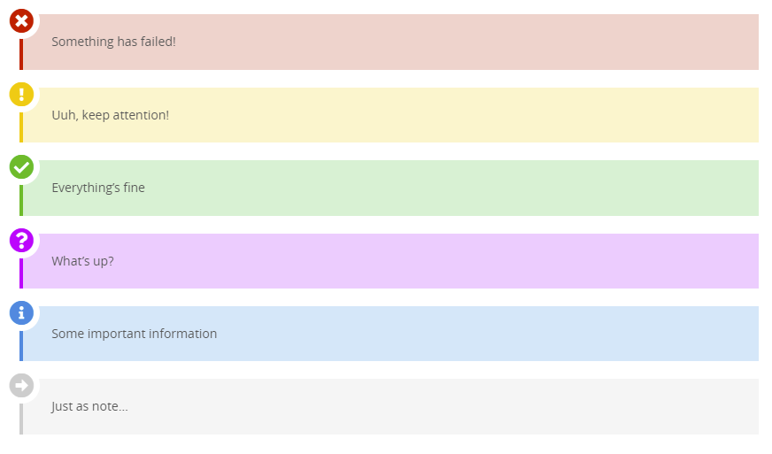

# hexo-tag-plugins

**Hexo Tag Plugin Collection from kiko.io**

## Introduction

**[Hexo](https://hexo.io/)** is a [Markdown](https://en.wikipedia.org/wiki/Markdown) based SSG (Static Site Generator). Because the Mardown syntax is limited for good reason, Hexo has ***tag plugins*** you can use in your content to simplify and centralize complex structures, instead of writing pure HTML. For more information, see [hexo.io/docs/tag-plugins](https://hexo.io/docs/tag-plugins.html).

This project is a growing collection of tag plugins that I have developed and use for my blog [kiko.io](https://kiko.io). Some of them are quite simple, others are more complex, but overall maybe helpful for you.

## Installation / Using

There is no automatic installation of all tag plugins via NPM or other package managers, because every tag plugin stands for itself and you can pick the one you need simply by copying the appropriate JS file into your Hexo's script folder: ``THEMES`` / ``<YOUR-THEME>`` / ``SCRIPTS``.

For every tag plugin in the list below I provide a [Visual Studio Code Snippet](https://code.visualstudio.com/docs/editor/userdefinedsnippets) to quickly insert a plugin into the content via the hotkey ``Ctrl+Space``. To use the snippest create a new ``.code-snippets`` file in your projects ``.vscode`` folder and insert the snippets of all tag plugins you have downloaded into your project.

### Parameter Description Syntax

Every tag plugin includes a description in the header how to use it. The syntax is as follows:

| Syntax | Description |
| --- | --- |
| ``param1`` | mandatory parameter |
| ``[param2]`` | optional parameter |
| ``[param2=default]`` | optional parameter with default value|
| ``param:(option1,option2)`` | parameter option list to choose one option |
| ``..."value1\|value2"``| pipe delimitered array of values |


## Plugins

[Anchor (tag-anchor)](#anchor-tag-anchor)
[Anchorlist (tag-anchorlist)]()
[Alertbox (tag-alertbox)]()
[Alternative Blockquote (tag-blockquote_alt)](#alternative-blockquote-tag-blockquote_alt)


## Anchor (tag-anchor)

A simple anchor element as ``A``- or ``HR``-Tag as jump target for example from a ``Anchorlist``.

**Syntax:**  

```txt
``
```

**Example:**

```js

```

**Output:**

```html
<hr id="my-anchor">
```

**VS Code Snippet:**

```json
"hexo.kiko-io.anchor": {
  "scope": "markdown",
  "prefix": "hexo.kiko-io.anchor",
  "body": [
    ""
  ],
  "description": "Insert kiko.io's anchor"
}
```


## Anchorlist (tag-anchorlist)

Creates an overview of all anchors in the content with jump links.

**Syntax:**  

```txt
``
```

**Example:**

```js

```

**Output:**

```html
<ul class="anchorlist">
  <li data-anchor="#a1">
    <a href="#a1">My First Anchor</a>
  </li>
  <li data-anchor="#a2">
    <a href="#a2">My Second Anchor</a>
  </li>
</ul>
```


**VS Code Snippet:**

```json
"hexo.kiko-io.anchorlist": {
  "scope": "markdown",
  "prefix": "hexo.kiko-io.anchorlist",
  "body": [
    ""
  ],
  "description": "Insert kiko.io's anchorlist"
}
```


## Alertbox (tag-alertbox)

Renders a iconized colored box with text for warnings or with some special information. 6 styles are provided: Exclamation, Question, Warning, Info, Success and Note.

**Prequisites:**

The icons are from the font **FontAwesome Free Solid**, you need to reference in your CSS either from your project or from a CDN. You will find such  references in the file ``tag-alertbox.css``, together with all other necessary styles.

**Syntax:**

```txt

content
``
```

**Example:**

```js

Something has failed!

```

**Output:**

```html
<div class="alertbox alertbox-warning">
  <p>Something has failed!</p>
</div>
```



**VS Code Snippet:**

```json
"hexo.kiko-io.alertbox": {
  "scope": "markdown",
  "prefix": "hexo.kiko-io.alertbox",
  "body": [
    "",
    "${2:content}",
    ""
  ],
  "description": "Insert kiko.io's alertbox"
}
```


## Alternative Blockquote (tag-blockquote_alt)

An alternative blockquote tag plugin for quotes with citator and reference url.

**Syntax:**  

```txt

quote

```

**Example:**

```js

Lorem ipsum dolor sit amet...

```

**Output:**

```html
<div>
  <blockquote>
    <p>Lorem ipsum dolor sit amet…</p>
  </blockquote>
  <cite>
    <a href="https://en.wikipedia.org/wiki/Lorem_ipsum">--- Anonymous</a>
  </cite>
</div>
```


**VS Code Snippet:**

```json
"hexo.kiko-io.blockquote": {
  "scope": "markdown",
  "prefix": "hexo.kiko-io.blockquote",
  "body": [
    "",
    "${3:content}",
    ""
  ],
  "description": "Insert kiko.io's blockquote"
}
```


## License

**MIT** : http://opensource.org/licenses/MIT